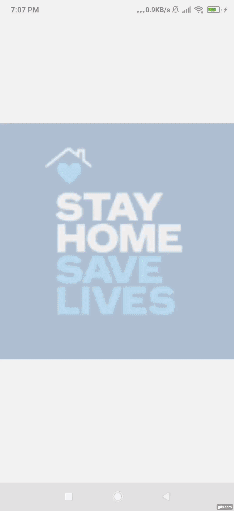

# covid19mobApp
Tracking the impact of COVID-19 in India 

<table>
  <tr style=“margin:20px;>
    <td style=“margin:10px;”></td>
  </tr>
  <tr>
    <td style=“margin:10px;”></td>
    <td style=“margin:10px;”></td>
  </tr>
</table>

<h2> Name : Covid19 Mobile App </h2>
<h3> Technologies : React-native js </h3> 
<h4> Key features: </h4> 
 <ol>
  <li>State level and district level Reports</li>
  <li>Essential Service(district and state level)</li>
  <li>Zone wised classification</li>
  <li>Demograhics data</li>
  <li> User Zone detection and details about restrictions</li>
  <li>Share details to other Apps available</li>
</ol>
   
